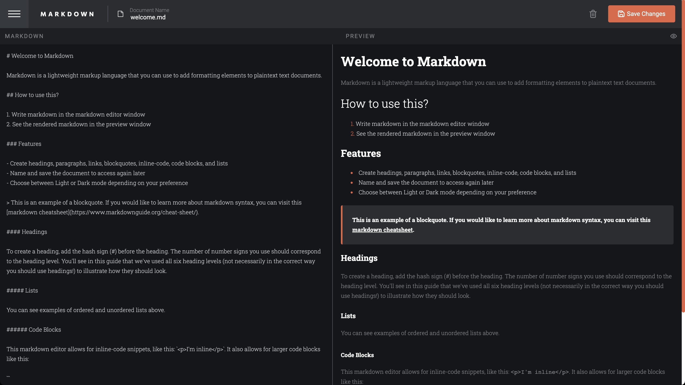

# Frontend Mentor - In-browser markdown editor solution

This is a solution to the [In-browser markdown editor challenge on Frontend Mentor](https://www.frontendmentor.io/challenges/inbrowser-markdown-editor-r16TrrQX9). Frontend Mentor challenges help you improve your coding skills by building realistic projects. 

## Table of contents

- [Overview](#overview)
  - [The challenge](#the-challenge)
  - [Screenshot](#screenshot)
  - [Links](#links)
- [My process](#my-process)
  - [Built with](#built-with)
  - [What I learned](#what-i-learned)
  - [Continued development](#continued-development)
  - [Useful resources](#useful-resources)
- [Author](#author)

## Overview

### The challenge

Users should be able to:

- Create, Read, Update, and Delete markdown documents
- Name and save documents to be accessed as needed
- Edit the markdown of a document and see the formatted preview of the content
- View a full-page preview of the formatted content
- View the optimal layout for the app depending on their device's screen size
- See hover states for all interactive elements on the page
- **Bonus**: If you're building a purely front-end project, use localStorage to save the current state in the browser that persists when the browser is refreshed
- **Bonus**: Build this project as a full-stack application

### Screenshot

### Links

- Solution URL: [Github](https://github.com/remyboire/markdowneditor)
- Live Site URL: [Github Page](https://remyboire.github.io/markdowneditor/)

## My process

### Built with

- [React](https://reactjs.org/) - JS library

### What I learned

I took [Bob's Ziroll](https://twitter.com/bobziroll) amazing [Learn React Course](https://scrimba.com/learn/learnreact) on scrimba last week and this challenge was perfect for me to practice every notion I learned. I was the first time I build a React app from scratch and I learned a lot about components, props, states, localstorage, effects, dark mode (even if I didn't spend much time on it) etc.
I tried to add a few functionalities like the possibility to download your document once saved, or delete a doc by clicking the icon on the sidebar (when the sidebar is open, the button in the header was hidden).

### Continued development

I didn't care much about CSS and I feel like my code isn't very great, but it wasn't the purpose of this challenge for me. In the future, when I'll forget about my code,  I'd like to rework on this project to improve it and see if it's clear enough for someone else. I use React-mde package and would like to replace it and code my own solution for the editor. 
Saving with cmd+S would be a nice little feature to add too.

### Useful resources

- [Scrimba - learn react for free](https://scrimba.com/learn/learnreact) - This course is very great and really fits my learning method.

## Author

- Website - [Rémy Boiré](https://www.remyboirefr)
- Frontend Mentor - [@yourusername](https://www.frontendmentor.io/profile/remyboire)

